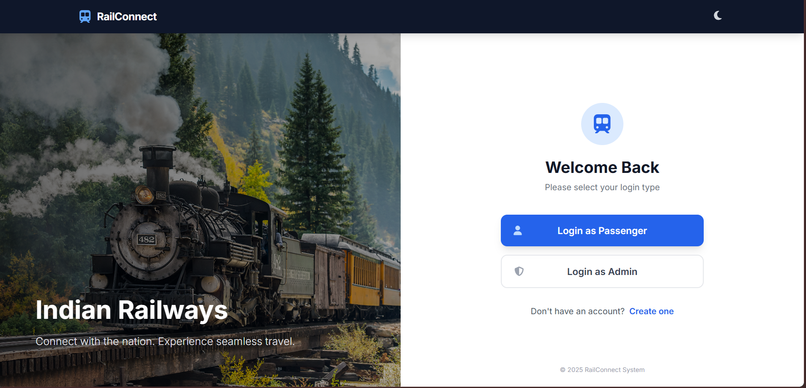
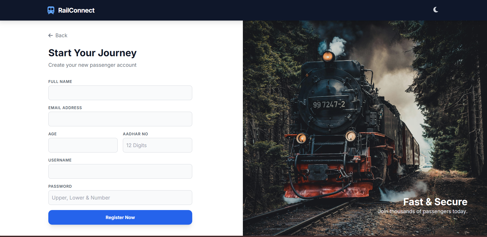
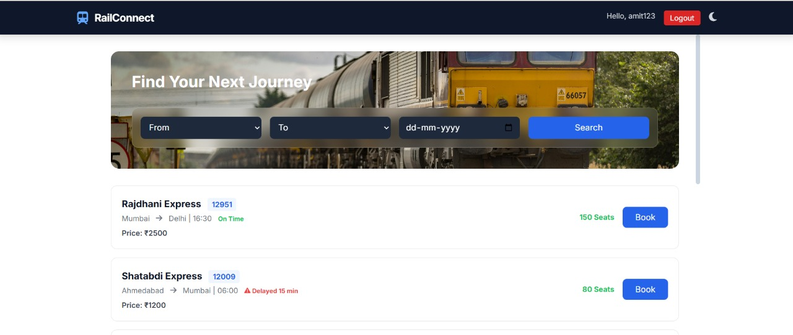

# 🚆 RailConnect  
### A Relational Database Management System Project

RailConnect is a web-based Railway Management System developed to demonstrate practical implementation of core **Database Management System (DBMS)** concepts.

The system integrates a **MySQL relational database**, a **Python Flask backend**, and a responsive frontend built with **HTML, Tailwind CSS, and JavaScript**.

This project focuses on understanding how relational databases power real-world applications such as railway reservation systems.

## 📌 Project Objective

The main objective of RailConnect is to:

- Design a normalized relational database schema  
- Implement complete CRUD operations  
- Maintain referential integrity using foreign keys  
- Connect backend logic with database securely  
- Build a full-stack application using three-tier architecture  

## 🏗️ System Architecture

RailConnect follows a **Three-Tier Architecture**:

**Frontend (HTML, CSS, JavaScript)**  
↓  
**Backend (Python Flask)**  
↓  
**Database (MySQL 8.0)**  

### Tech Stack

| Layer       | Technology |
|------------|------------|
| Frontend   | HTML5, Tailwind CSS, JavaScript |
| Backend    | Python, Flask |
| Database   | MySQL 8.0 |

## 🗄️ Database Design

The system is built around three core entities:

### 👤 Users  
Stores login credentials and user details.

### 🚆 Trains  
Stores train information such as route, date, seat availability, price, and delay.

### 🎫 Bookings  
Links users and trains using foreign keys.

### Relationships

- One User → Many Bookings (1:N)  
- One Train → Many Bookings (1:N)  

Foreign key constraints ensure relational consistency.  
`ON DELETE CASCADE` prevents orphan booking records when a train is removed.

## ⚙️ Core Functionalities

### ✅ Create
- User Registration  
- Add Train (Admin)  
- Book Ticket  

### 📖 Read
- Login Authentication  
- View Available Trains  
- View User Bookings (SQL JOIN used)  

### 🔄 Update
- Automatic seat decrement during booking  
- Real-time seat availability  

### ❌ Delete
- Admin can delete trains  
- Related bookings auto-delete via CASCADE  

## 🔌 Backend & API Design

- Parameterized SQL queries prevent SQL Injection  
- REST API endpoints built using Flask  
- JSON-based frontend-backend communication  
- Controlled database connection lifecycle  

Key Endpoints:
- `/api/register`
- `/api/login`
- `/api/book`

Seat booking logic ensures atomic updates to avoid inconsistent seat counts.

# 🖥️ Application Screens

## 🔐 Login Screen

The main landing page provides:
- Passenger Login  
- Admin Login  
- Registration access  
- Responsive split-screen design  

## 👤 Create New User

Users can:
- Register with personal details  
- Validate input fields  
- Create secure login credentials  

## 🎫 Book Train

Passengers can:
- Search trains by source and destination  
- View seat availability  
- Book tickets  
- Generate PNR  
- Automatically update seat count  

## 🔄 End-to-End Workflow

1. User registers  
2. Backend inserts data into MySQL  
3. User logs in  
4. Searches train  
5. Books ticket  
6. Seat count decreases automatically  
7. Booking record stored with generated PNR  

Admin dashboard reflects changes instantly.

## 📚 Key Learnings

- Database normalization  
- Foreign key implementation  
- Maintaining referential integrity  
- Using SQL JOIN queries  
- Backend–database integration  
- Dynamic UI updates using Fetch API  

## 🚀 Future Enhancements

- Payment Gateway Integration  
- Password Hashing  
- JWT Authentication  
- Seat Selection Interface  
- Live Train Tracking  

## 👨‍💻 Contributors

- Pradeep Kumar  
- Harphool Singh Bajdoliya  
- Academic Guidance: Dr. Surya Prakash  

## 🎯 Conclusion

RailConnect demonstrates how relational databases power real-world web applications.  

The project successfully integrates SQL constraints, backend logic, and a dynamic frontend to build a functional railway reservation system while reinforcing fundamental DBMS concepts.
